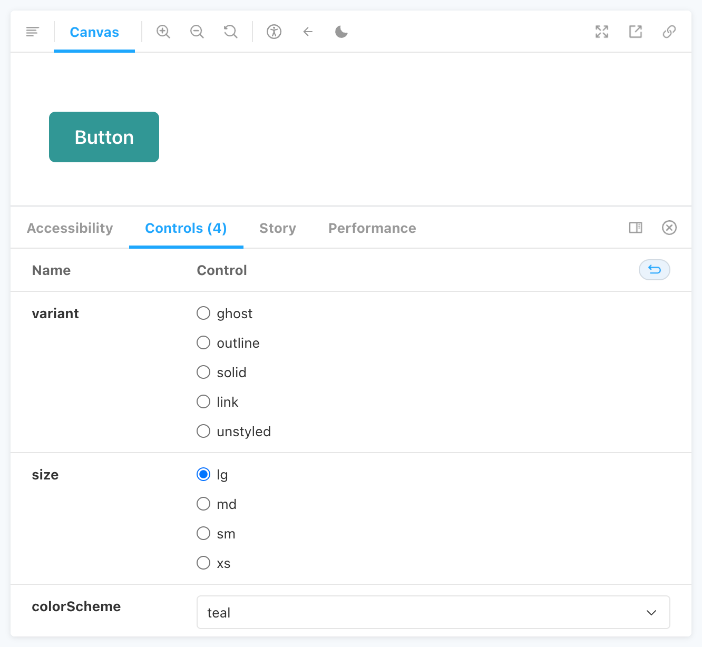

# @luniand-ui/storybook-addon

Use Luniand UI in your Storybook stories.

This Plugin wraps each of your stories with [`LuniandProvider`][luniandprovider]
which can be configured using Storybook parameters.

## Installation

### yarn

```sh
yarn add -D @luniand-ui/storybook-addon
```

### npm

```sh
npm i -D @luniand-ui/storybook-addon
```

Add the addon to your configuration in `.storybook/main.js` and disable the
emotion alias (available with Storybook >6.4).

```js
module.exports = {
  addons: ["@luniand-ui/storybook-addon"],
  features: {
    emotionAlias: false,
  },
}
```

## Configuring `LuniandProvider`

If you need to customize the props passed to `LuniandProvider` for your stories
(to use a custom `theme`, for example), you'll need to create custom Storybook
parameters.

To set global parameters for this addon, add a `luniand` object to the
`parameters` export in `.storybook/preview.js`:

```js
import myTheme from "../theme"

export const parameters = {
  luniand: {
    theme: myTheme,
  },
}
```

The `luniand` parameters take the same shape as the `props` for `LuniandProvider`.
[See the `LuniandProvider` props table][luniandprovider] to see the list of
possible parameters.

### Overriding `LuniandProvider` configuration for individual components or stories

Storybook allows you to define parameters at multiple levels: global, component,
and story. We recommend setting default parameters at the global level, and
overriding them at the component or story when necessary. See the
[Storybook Parameters documentation](https://storybook.js.org/docs/react/writing-stories/parameters)
for more information.

## Color Mode Tool

You will be able to toggle your color mode with the button in the toolbar. It
tries to sync with your theme through the localstorage key.

## Story Controls for Theme Components

Get controls for the theming props `variant`, `size` and `colorScheme` in your
stories with `getThemingArgTypes(theme, componentName)`.

```tsx
import { Meta, StoryFn } from "@storybook/react"
import { getThemingArgTypes } from "@luniand-ui/storybook-addon"
import { theme } from "<your-theme>"

export default {
  title: "Components / Forms / Button",
  // get controls for `variant`, `size` and `colorScheme`
  argTypes: getThemingArgTypes(theme, "Button"),
} as Meta

interface StoryProps extends ThemingProps<"Button"> {}

export const Basic: StoryFn<StoryProps> = (props) => (
  <Button {...props}>Button</Button>
)
```

This will render input fields to choose the theming prop values:



[luniandprovider]:
  https://luniand-ui.com/docs/getting-started#luniandprovider-props
